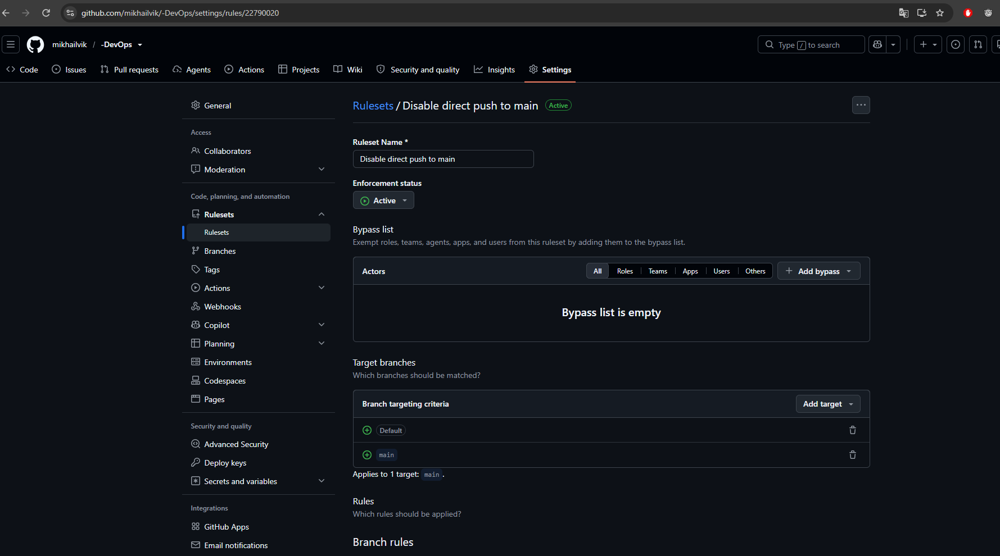
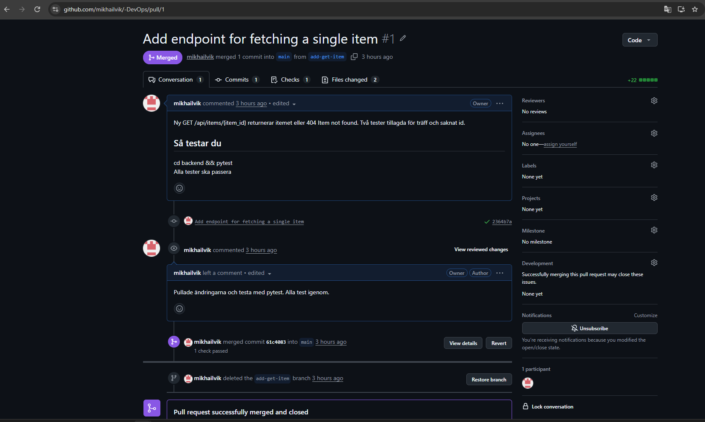
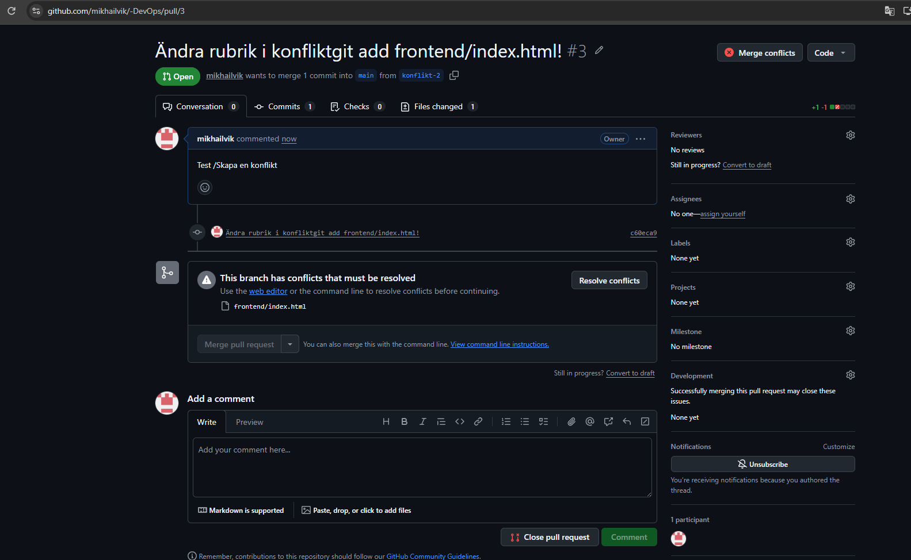
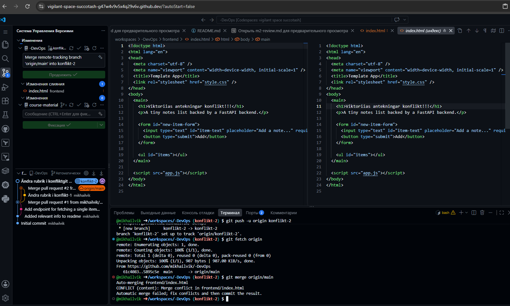
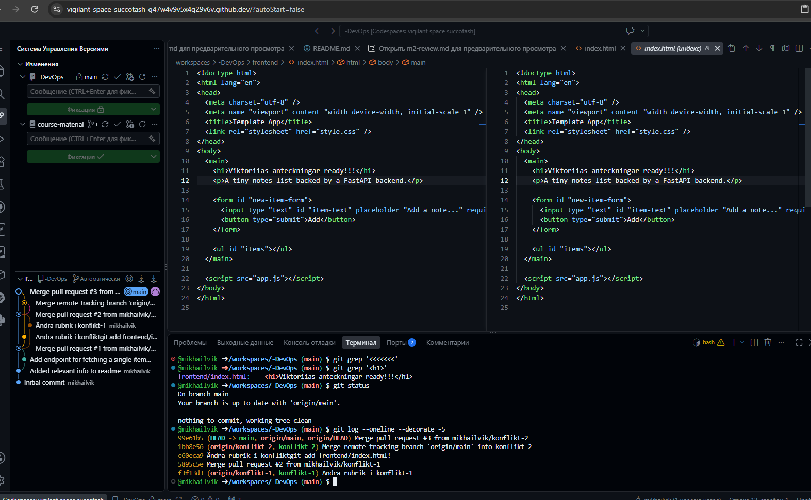

# M2 – Branch protection, buddy-review och en riktig konflikt

## Steg 1 – Branch protection

Jag skapade en branch ruleset för `main` i GitHub under Settings → Rules → Rulesets. 
Rulesetens status sattes till Active och Pull Request krävs innan ändringar kan mergas. 
Eftersom arbetet gjordes individuellt sattes Required approvals till 0. 
Jag verifierade inställningen genom att kontrollera ruleset-konfigurationen i GitHub.

## Steg 2 – Test av branch protection

Jag testade branch protection genom att försöka pusha en tom commit direkt till `main` från terminalen. 
GitHub blockerade pushen eftersom ändringar till `main` måste gå via en Pull Request enligt ruleset. 
På så sätt verifierade jag att branch protection fungerar som förväntat.

## Steg 4 – Review av Pull Request

Jag skapade en Pull Request för ändringen `add-get-item` och granskade ändringarna i GitHub. 
Eftersom arbetet gjordes individuellt kunde vi inte godkänna vår egen Pull Request, därför använde jag en vanlig review-kommentar och en line comment. 
Jag kontrollerade också att testerna kördes med `cd backend && pytest` och att de fungerade. 
Efter granskningen mergades Pull Requesten till `main`.

## Steg 5 – Konflikthantering

Jag skapade två separata branches, `konflikt-1` och `konflikt-2`, från samma utgångspunkt och ändrade samma `<h1>`-rad på olika sätt. 
Efter att den första Pull Requesten mergades uppstod en konflikt i den andra Pull Requesten. 
Konflikten upptäcktes med `git merge origin/main` i terminalen och löstes så att ändringarna kunde mergas till `main`. 
Jag verifierade slutligen att det inte fanns några konfliktmarkörer kvar med `git grep '<<<<<<<'`.

## Steg 6 Milstolpe

Milstolpen markerades med Git-taggen `m2-review`. 
De fem skärmdumparna ovan dokumenterar det arbete som gjordes utanför själva koden i repot.