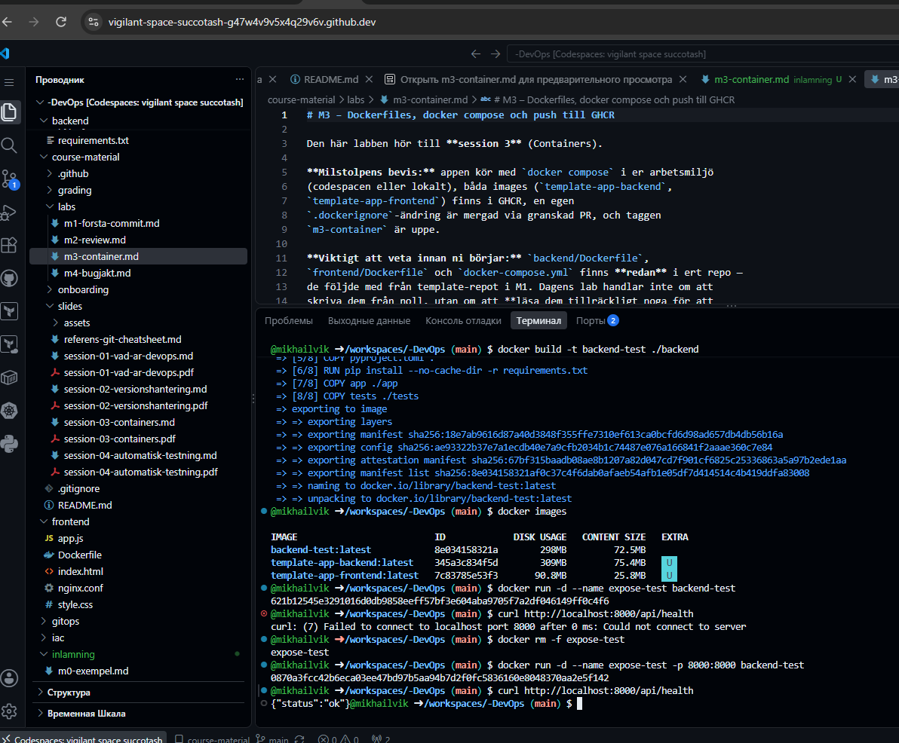
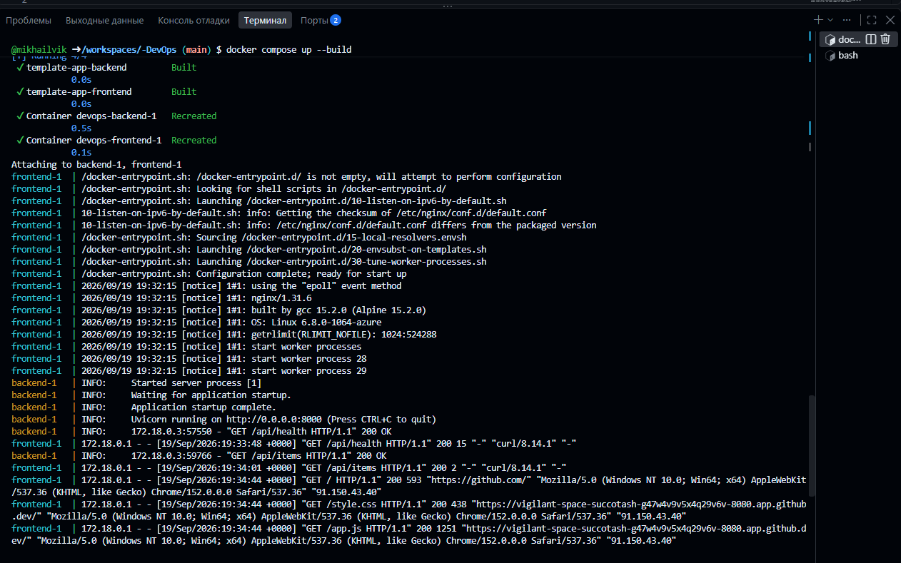
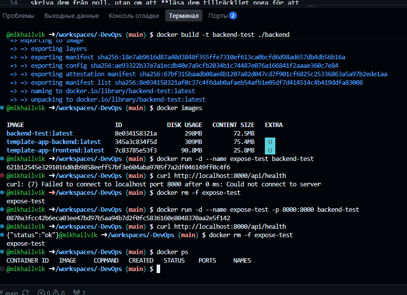
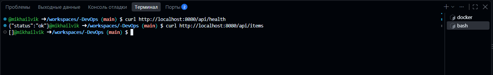
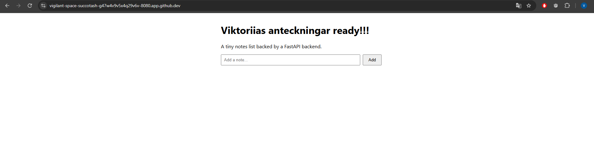
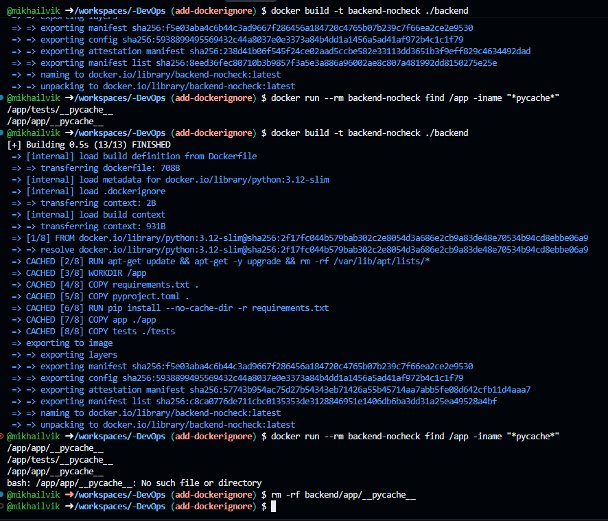
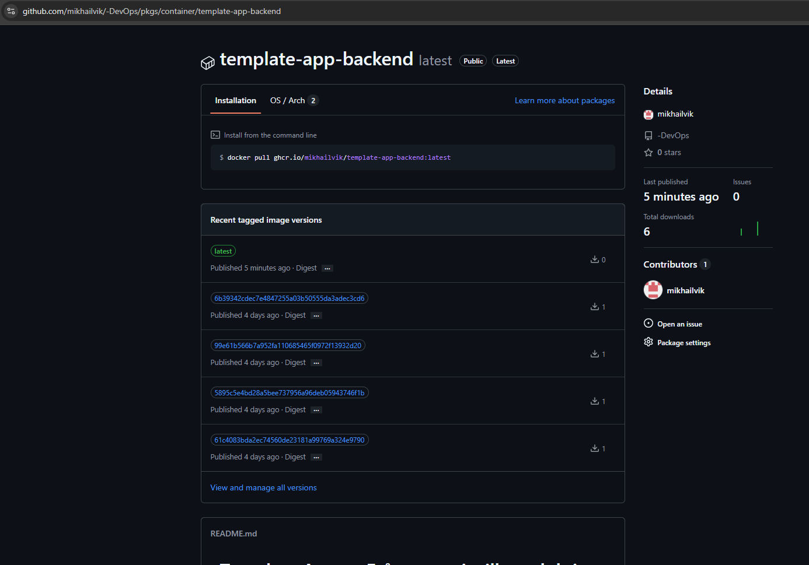
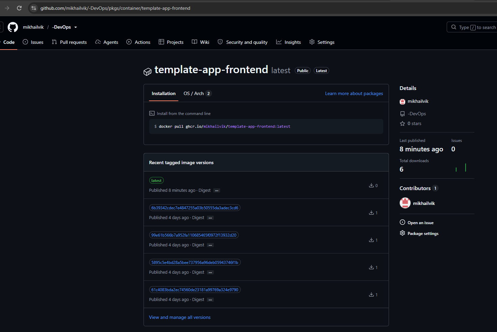

# M3 – Containers

## Backend Dockerfile

### 1. Vilken rad avgör Python-versionen?

Raden `FROM python:3.12-slim` avgör vilken Python-version imagen bygger på och den använder Python 3.12.

### 2. Varför kopieras requirements.txt före app-koden?

`COPY requirements.txt .` och `RUN pip install ...` ligger före
`COPY app ./app` för att Docker ska kunna använda sin cache.

Om bara applikationskoden ändras behöver Python-paketen inte installeras på nytt och det gör bygget snabbare.

### 3. Vad gör EXPOSE 8000?

Jag tycker att `EXPOSE 8000` inte publicerar porten till hosten. Det dokumenterar bara vilken port applikationen använder.

För att nå containern från hosten behövs en portmappning, till exempel `-p 8000:8000`.

## Steg 1 – Dockerfile och portar

Jag undersökte backend/Dockerfile och gjorde följande tester.

`FROM python:3.12-slim` bestämmer Python-versionen.

Jag testade också `EXPOSE 8000`. Jag såg att EXPOSE inte publicerar porten till hosten. För att nå API:t behövdes:

`docker run -d --name expose-test -p 8000:8000 backend-test`

Efter det fungerade:

`curl http://localhost:8000/api/health`

Resultat:

`{"status":"ok"}`

## Steg 2 – Frontend och backend

Frontend kör nginx och skickar `/api/...` vidare till backend på `backend:8000`.

Jag kontrollerade detta genom att starta projektet med Docker Compose.

## Steg 3 – Docker Compose

Jag körde:

`docker compose up --build`

Både frontend och backend startade korrekt.

Jag testade:

`curl http://localhost:8080/api/health`

Resultatet blev:

`{"status":"ok"}`

Jag testade också `/api/items` och fick ett svar från backend.

## Steg 4 – .dockerignore

Jag skapade `.dockerignore` för backend och frontend.

För backend lade jag till regler för att ignorera bland annat:

`__pycache__`, `*.pyc`, `.pytest_cache` och `.ruff_cache`.

Jag skapade en testfil i `__pycache__` och byggde sedan imagen med `.dockerignore`.

Efteråt körde jag:

`docker run --rm backend-check find /app -iname "*pycache*"`

Kommandot gav ingen output, vilket visar att `__pycache__` inte följde med in i imagen.

## Steg 5 – GHCR

Jag byggde och pushade backend- och frontend-images till GitHub Container Registry (GHCR).

Båda paketen har en ny `latest`-version med en färsk tidsstämpel.

## Sammanfattning

Jag har testat Docker-portar, Docker Compose och `.dockerignore`. Jag har också kontrollerat att frontend och backend kan kommunicera och att onödiga Python-cachefiler inte följer med in i backend-imagen.