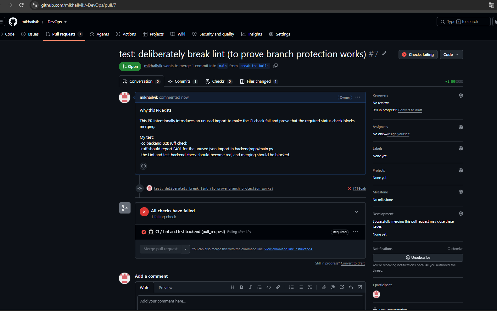
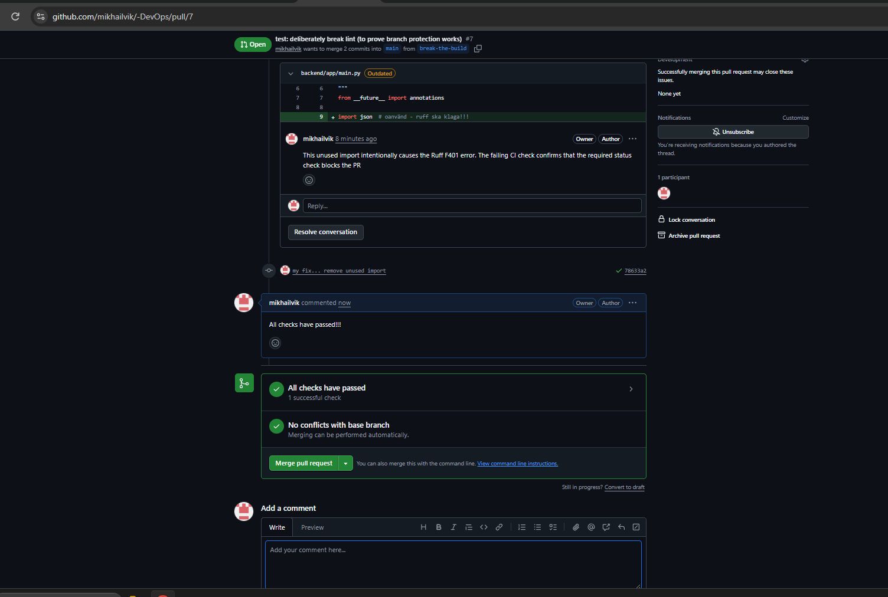
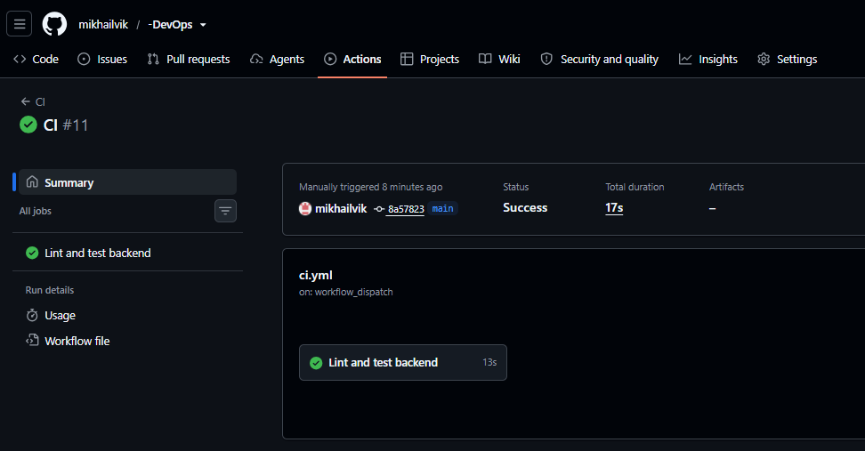

# M5 – CI

## Steg 2 – Röd CI-check

Jag lade medvetet till en oanvänd `json`-import. CI blev röd och PR kunde inte mergas.

## Steg 3 – Fix och grön CI-check

Jag tog bort den oanvända importen. CI blev grön och PR kunde mergas.

## Steg 4 – Manuell körning av CI

Jag lade till `workflow_dispatch` och startade CI manuellt på `main`. Workflow-körningen lyckades.

