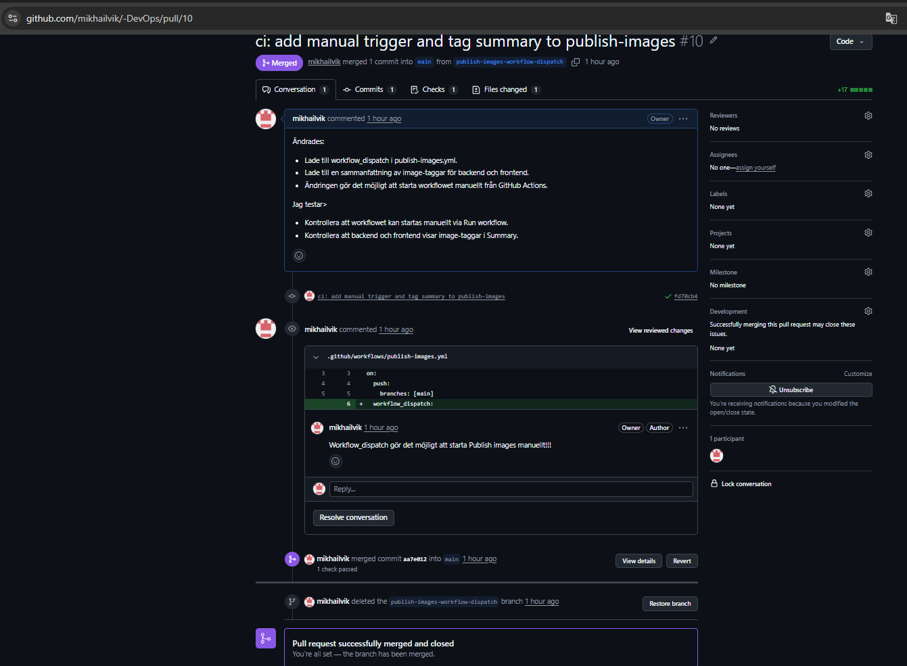
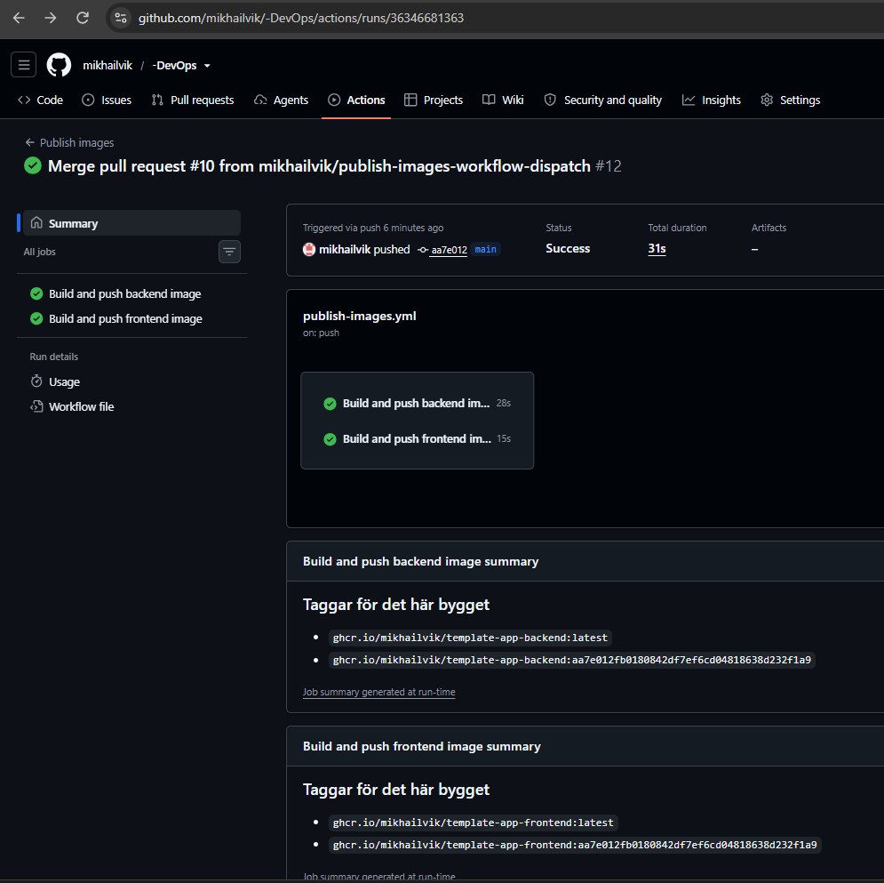
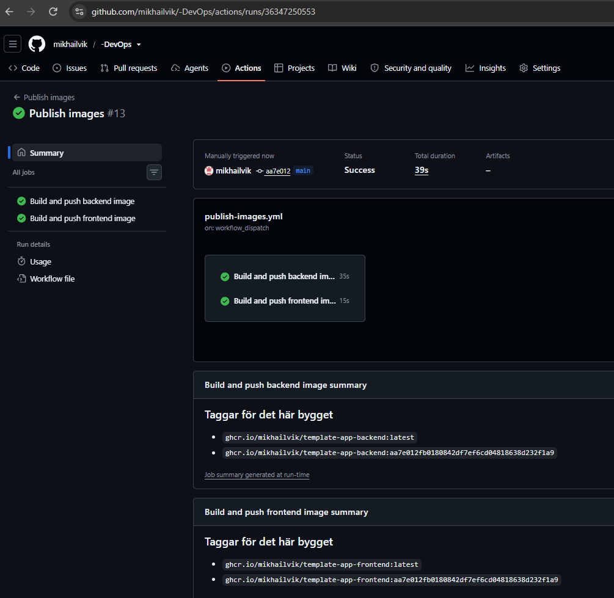
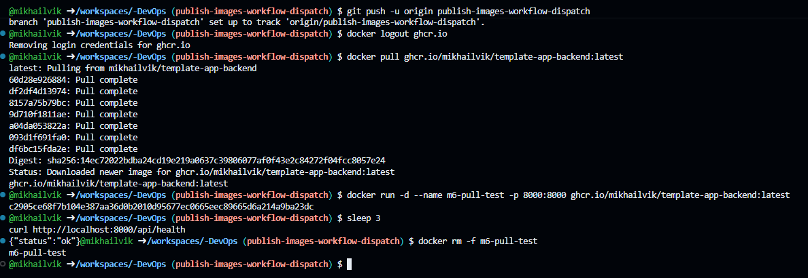
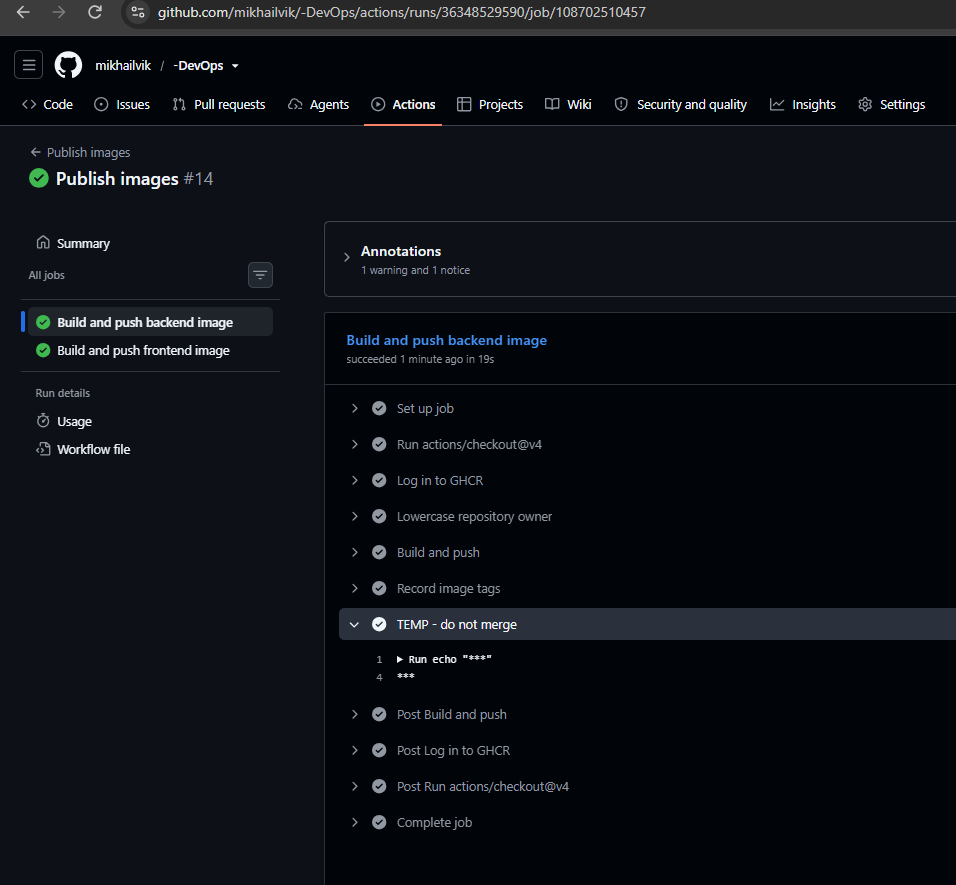

M6 – CD images
Steg 1 – Egen ändring i publish-images.yml

Jag gjorde en egen ändring i .github/workflows/publish-images.yml.

Jag lade till workflow_dispatch så att workflowet kan startas manuellt. Jag lade också till en job summary som visar image-taggarna för varje bygge.

Ändringen skickades via en egen branch och mergades genom PR #10.

Steg 2 – Automatisk publicering

Efter merge till main startade Publish images automatiskt.

Både backend- och frontend-images byggdes och publicerades till GitHub Container Registry (GHCR).

Workflowet kördes utan fel.

Steg 3 – Manuell körning

Jag testade också workflow_dispatch genom att starta Publish images manuellt från main.

Workflowet kördes utan fel och visade image-taggarna för både backend och frontend.

Steg 4 – Publika paket och pull utan login

Både backend- och frontend-paketen i GHCR är publika.

Jag loggade ut från GHCR och testade sedan att hämta backend-imagen utan inloggning.

Imagen kunde hämtas med docker pull och containern startade korrekt. Jag testade API med:

curl http://localhost:8000/api/health

Resultatet blev:

{"status":"ok"}

Steg 5 – GITHUB_TOKEN masking

Jag skapade en tillfällig branch för att testa hur GitHub hanterar GITHUB_TOKEN.

Jag lade till ett tillfälligt steg som skrev ut token i workflow-loggen. GitHub maskerade token automatiskt och visade *** i stället för det riktiga värdet.

Testbranchen togs sedan bort och ändringen mergades aldrig till main.

Sammanfattning

Jag har gjort en egen ändring i publish-images.yml, testat automatisk och manuell publicering av container-images och kontrollerat att GHCR-paketen är publika.

Jag har också testat att en image kan hämtas utan login och verifierat att GITHUB_TOKEN maskeras i GitHub Actions-loggen.