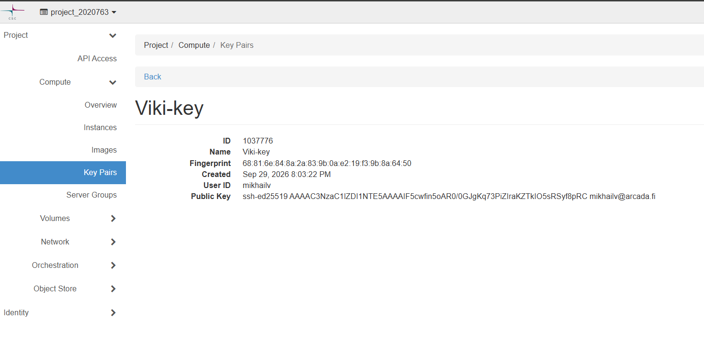
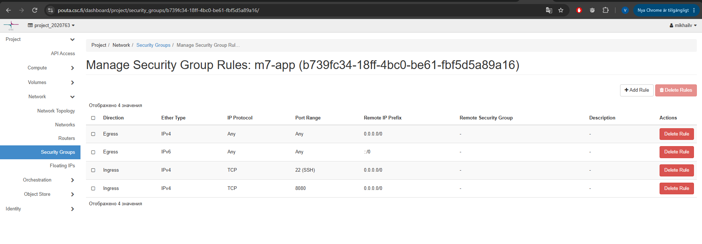
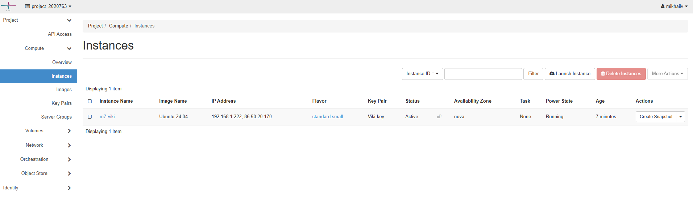
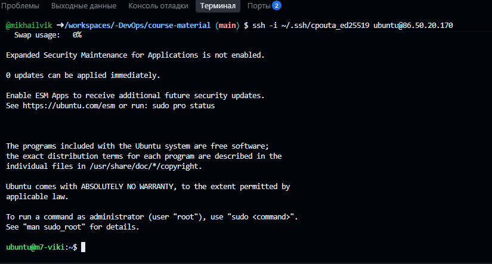
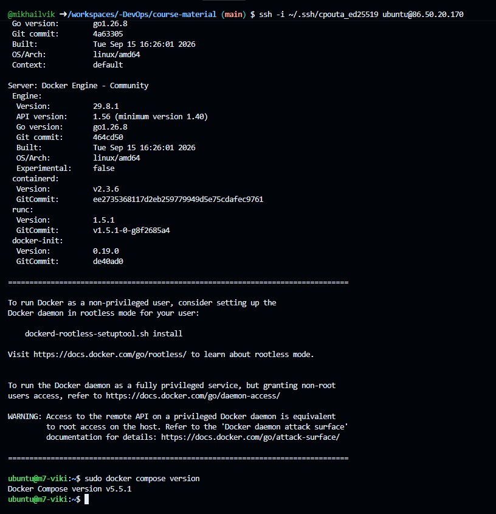
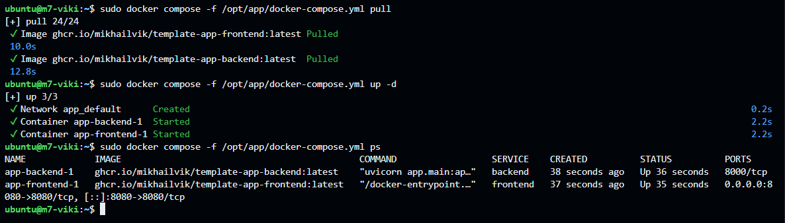
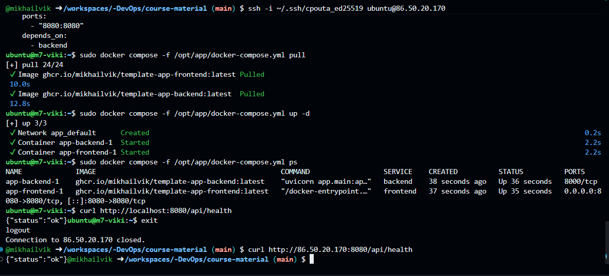
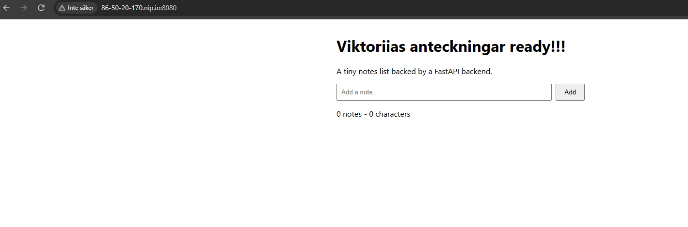

# M7 — VM i cPouta och manuell deployment

## Steg 1 — SSH-nyckel

Jag skapade ett eget ED25519-nyckelpar för SSH:

`~/.ssh/cpouta_ed25519`

Den privata nyckeln har inte lagts i repositoryt.

---

## Steg 2 — Key Pair i cPouta

Jag importerade min publika SSH-nyckel till cPouta som `Viki-key`.



## Steg 3 — Security Group

Jag skapade Security Group `m7-app`.

Ingress-regler:

* TCP 22 (SSH) från `0.0.0.0/0`
* TCP 8080 från `0.0.0.0/0`



## Steg 4 — Skapa VM

Jag skapade VM `m7-viki` med:

* Ubuntu 24.04
* Flavor `standard.small`
* Key Pair: `Viki-key`
* Security Group: `m7-app`


## Steg 5 — Floating IP

VM:n fick:

* Intern IP: `192.168.1.222`
* Floating IP: `86.50.20.170`

Status: `Active`

Power State: `Running`



## Steg 6 — SSH

Jag anslöt till VM:n från Codespace med SSH:

```bash
ssh -i ~/.ssh/cpouta_ed25519 ubuntu@86.50.20.170
```

SSH-anslutningen fungerade och jag kom in på VM:n som användaren `ubuntu`.



## Steg 7 — Partnernyckel

Jag arbetar ensam och behövde därför inte lägga till någon partnernyckel.


## Steg 8 — Docker

Jag installerade Docker på VM:n med:

```bash
curl -fsSL https://get.docker.com | sh
```

Docker installerades och startades korrekt.

Jag kontrollerade även att Docker Compose fungerade:

```bash
sudo docker compose version
```


## Steg 9 — Docker Compose och applikationen

Jag skapade `/opt/app/docker-compose.yml` och använde följande images från GitHub Container Registry:

* `ghcr.io/mikhailvik/template-app-backend:latest`
* `ghcr.io/mikhailvik/template-app-frontend:latest`

Jag hämtade images med:

```bash
sudo docker compose -f /opt/app/docker-compose.yml pull
```

och startade applikationen med:

```bash
sudo docker compose -f /opt/app/docker-compose.yml up -d
```

Jag kontrollerade containrarna med:

```bash
sudo docker compose -f /opt/app/docker-compose.yml ps
```

Både backend och frontend kördes korrekt.

* Backend: port `8000`
* Frontend: port `8080`



## Steg 10 — Test från utsidan

Först testade jag applikationen från själva VM:n:

```bash
curl http://localhost:8080/api/health
```

Resultat:

```text
{"status":"ok"}
```

Sedan testade jag från Codespace via VM:ns Floating IP:

```bash
curl http://86.50.20.170:8080/api/health
```

Resultat:

```text
{"status":"ok"}
```



Jag öppnade även applikationen i webbläsaren med nip.io:

`http://86-50-20-170.nip.io:8080/`

Applikationen visades korrekt i webbläsaren.




## Självkontroll

Jag har kontrollerat att:

* VM:n är `Active` och `Running`
* Floating IP fungerar
* Security Group tillåter port 22 och 8080
* Docker körs på VM:n
* Backend och frontend körs som containrar
* `/api/health` fungerar från utsidan
* applikationen kan öppnas via nip.io
* alla fem screenshots finns med i dokumentationen
