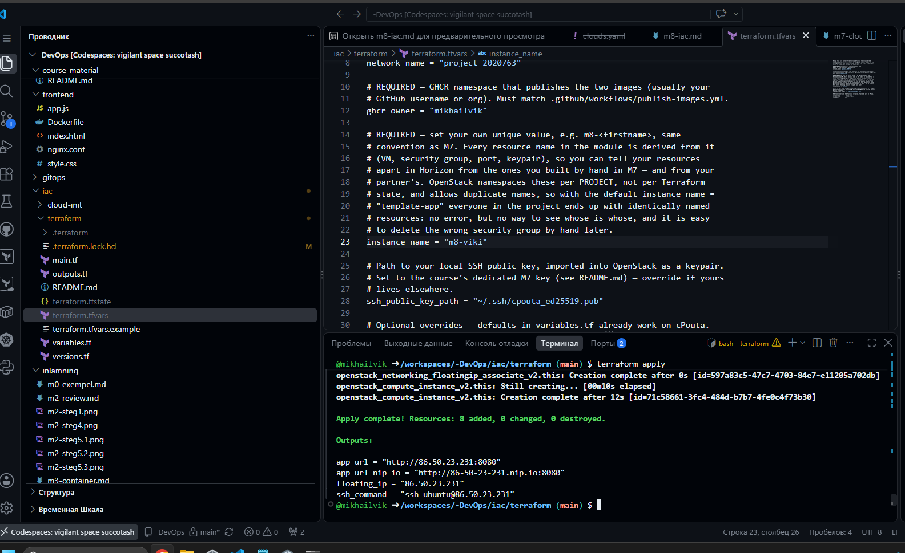
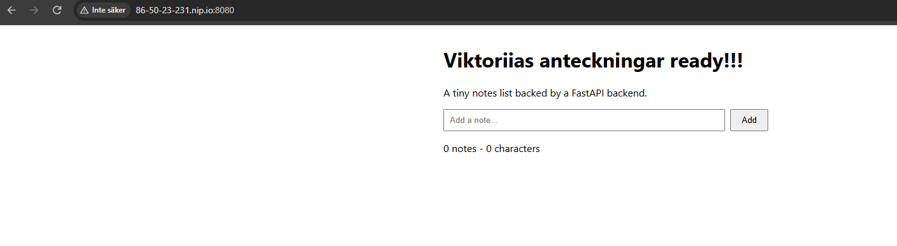
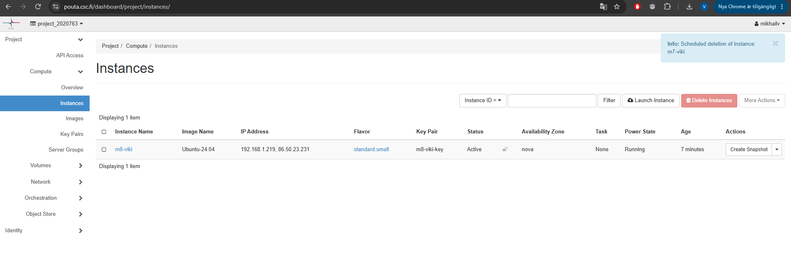
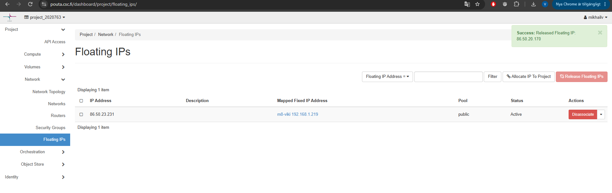
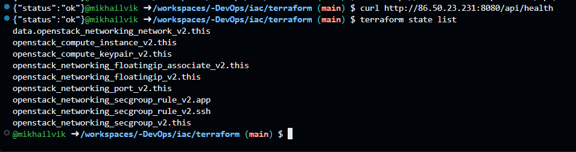
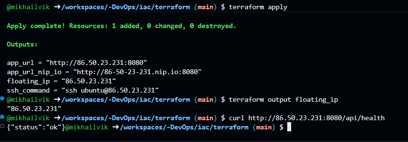

# M8 – Infrastructure as Code med Terraform

## Steg 4 – Första terraform apply
Terraform skapade infrastrukturen i cPouta från Terraform-konfigurationen.

## Steg 5 – Applikationen fungerar
Applikationen kunde nås via den nya floating IP-adressen och nip.io-adressen.

## Steg 6 – M7-resurser borttagna
Den manuellt skapade M7-instansen togs bort efter att M8-miljön hade verifierats.

Den gamla floating IP-adressen från M7 frigjordes. Endast M8-adressen finns kvar.

## Steg 7 – Terraform state
Jag kontrollerade Terraform state och såg resurserna som Terraform hanterar.

## Steg 8 – Rebuild med samma floating IP
VM-instansen byggdes om med Terraform. Floating IP-adressen var samma före och efter rebuild.

