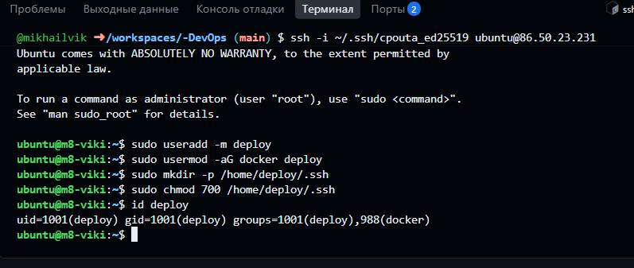
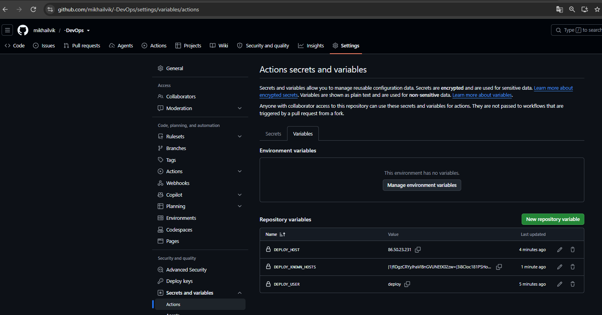
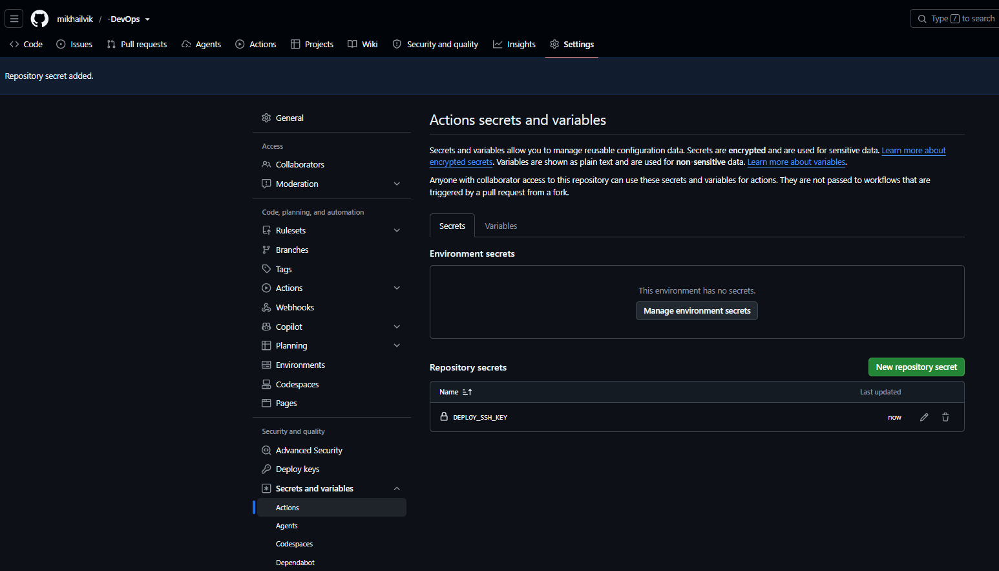
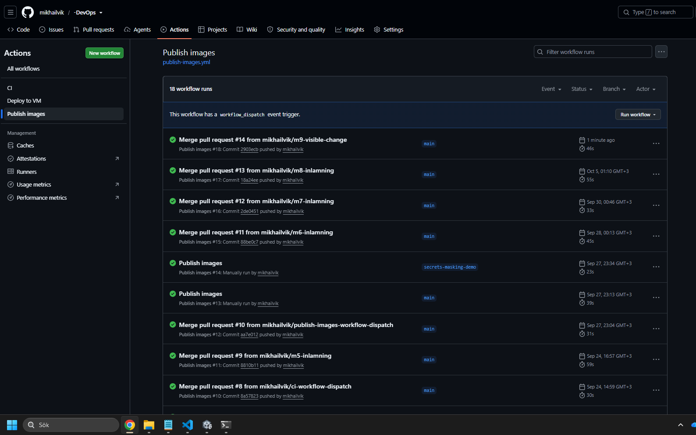
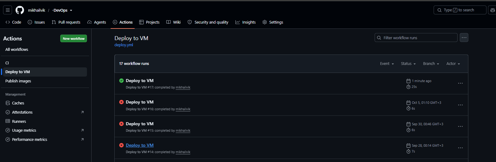
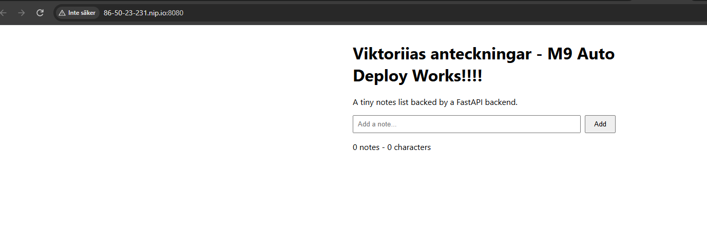

# M9 – SSH-deploy till produktion

## Steg 3 – Deploy-användare

Jag skapade användaren deploy på min VM och lade till den i Docker-gruppen. Jag konfigurerade SSH-nyckeln och kontrollerade att användaren hade rätt behörigheter.

## Steg 6 – GitHub Secrets och Variables

Jag skapade tre variabler: DEPLOY_USER, DEPLOY_HOST och DEPLOY_KNOWN_HOSTS. Jag lade också till DEPLOY_SSH_KEY som en GitHub Secret för säker SSH-anslutning.

## Steg 9 – Automatisk deploy

Jag ändrade rubriken på webbplatsen och mergade PR #14 till main. GitHub Actions körde först Publish images och sedan Deploy to VM. Båda körningarna blev gröna.

## Steg 10 – Kontroll av applikationen

Jag öppnade webbplatsen via nip.io och såg den nya rubriken "Viktoriias anteckningar - M9 Auto Deploy Works!!!!". Jag testade också /api/health med curl och fick svaret {"status":"ok"}.

